# Smart Sack Farming - System Design Documentation

## Table of Contents
1. [System Architecture](#1-system-architecture)
2. [Software Architecture](#2-software-architecture)
3. [Database Design (ERD)](#3-database-design-erd)
4. [Procedural Design (Flowcharts)](#4-procedural-design-flowcharts)
5. [Object-Oriented Design (UML)](#5-object-oriented-design-uml)
6. [Process Design (DFD)](#6-process-design-dfd)

---

## 1. System Architecture

### Description
The Smart Sack Farming system follows a three-tier client-server architecture with a Flutter mobile application as the presentation layer, Supabase as the Backend-as-a-Service (BaaS), and PostgreSQL as the database layer. The system integrates real-time data synchronization, user authentication, and cloud storage for farm images.

### Mermaid Code
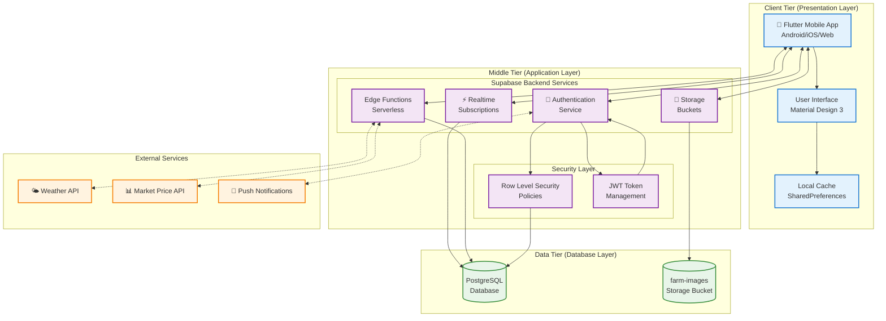

---

## 2. Software Architecture

### Description
The application follows a layered architecture pattern with clear separation of concerns. The presentation layer uses Flutter widgets and screens, the business logic layer contains services and repositories implementing the Repository pattern, and the data layer handles database operations through Supabase client.

### Mermaid Code
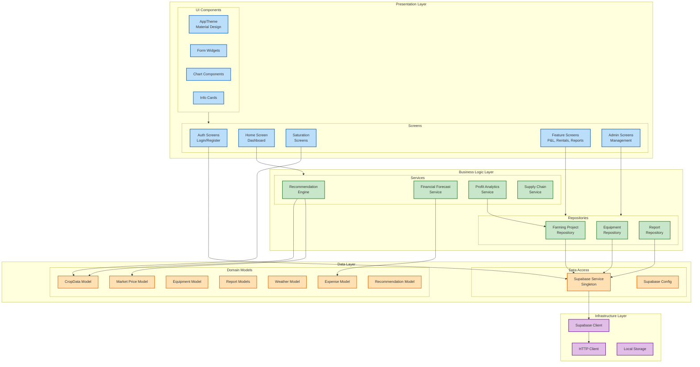

---

## 3. Database Design (ERD)

### Description
The database follows Third Normal Form (3NF) with proper foreign key relationships. The schema centers around the `profiles` table (extending Supabase Auth), with related entities for farming projects, expenses, equipment rentals, saturation records, and various report types. Row Level Security (RLS) policies enforce data access control.

### Mermaid Code
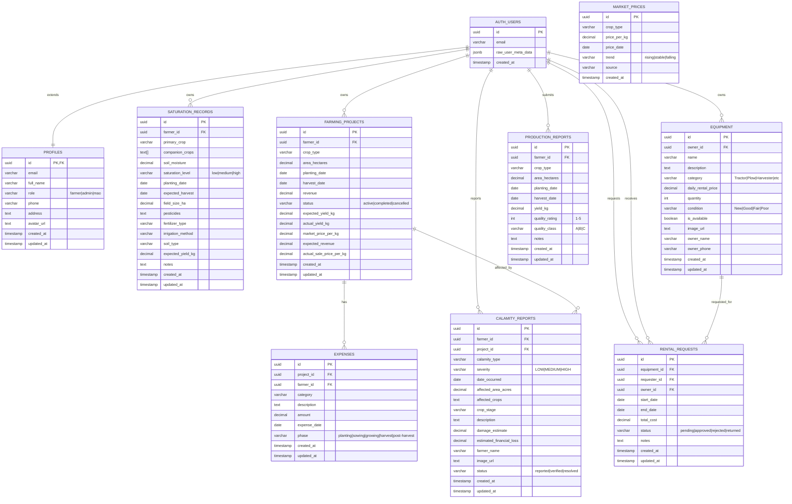

---

## 4. Procedural Design (Flowcharts)

### 4.1 User Authentication Flow

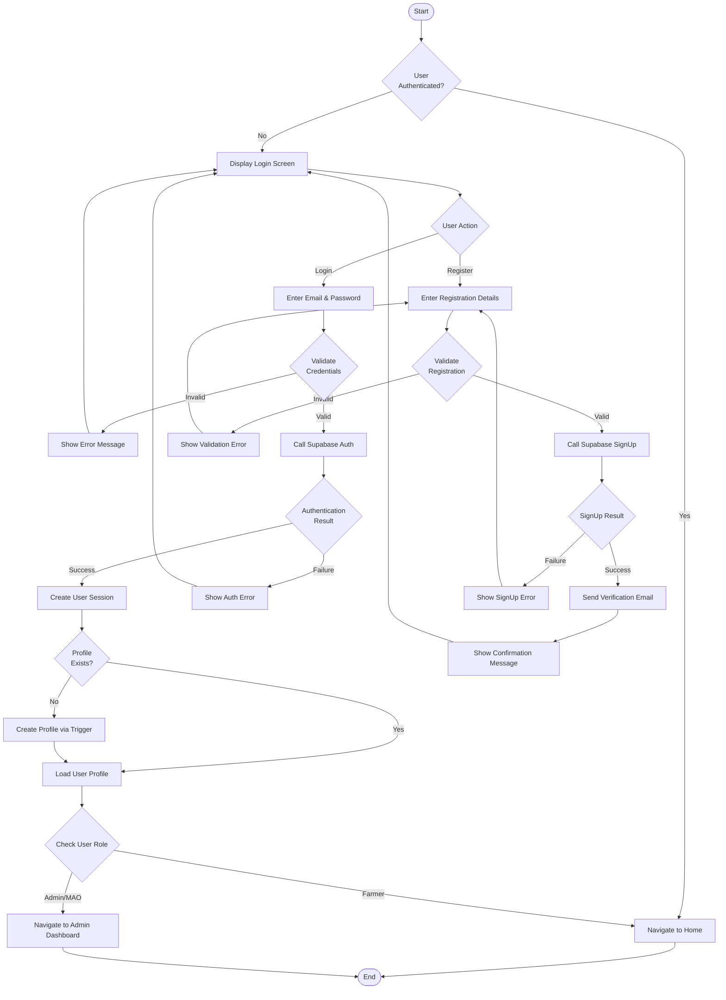

### 4.2 Crop Recommendation Flow

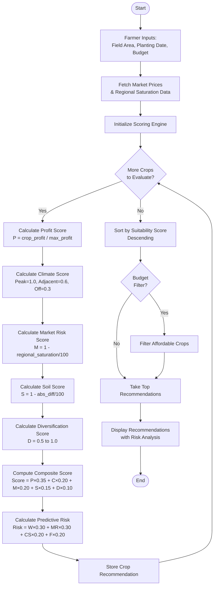

### 4.3 Farming Project Lifecycle Flow

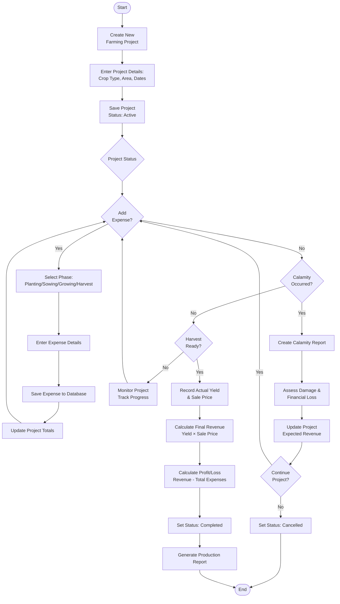

### 4.4 Equipment Rental Flow

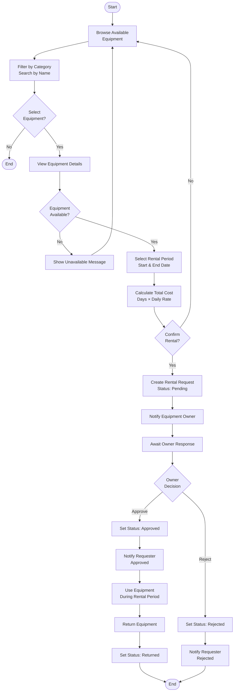

---

## 5. Object-Oriented Design (UML)

### 5.1 Use Case Diagram

```mermaid
flowchart TB
    subgraph Actors
        FARMER((👨‍🌾 Farmer))
        ADMIN((👨‍💼 Admin))
        MAO((🏛️ MAO Officer))
        SYSTEM((⚙️ System))
    end
    
    subgraph AuthModule["Authentication Module"]
        UC1[Register Account]
        UC2[Login]
        UC3[Manage Profile]
        UC4[Reset Password]
    end
    
    subgraph FarmingModule["Farming Management Module"]
        UC5[Create Farming Project]
        UC6[Track Expenses]
        UC7[Record Saturation Data]
        UC8[Generate P&L Report]
        UC9[Get Crop Recommendations]
        UC10[View Financial Forecast]
    end
    
    subgraph EquipmentModule["Equipment Rental Module"]
        UC11[List Equipment]
        UC12[Browse Equipment]
        UC13[Request Rental]
        UC14[Approve/Reject Rental]
        UC15[Return Equipment]
    end
    
    subgraph ReportingModule["Reporting Module"]
        UC16[Submit Calamity Report]
        UC17[Submit Production Report]
        UC18[View Market Prices]
        UC19[View Weather Data]
    end
    
    subgraph AdminModule["Administration Module"]
        UC20[Manage Users]
        UC21[Verify Reports]
        UC22[Update Market Prices]
        UC23[View Analytics Dashboard]
        UC24[Generate System Reports]
    end
    
    %% Farmer connections
    FARMER --> UC1
    FARMER --> UC2
    FARMER --> UC3
    FARMER --> UC5
    FARMER --> UC6
    FARMER --> UC7
    FARMER --> UC8
    FARMER --> UC9
    FARMER --> UC10
    FARMER --> UC11
    FARMER --> UC12
    FARMER --> UC13
    FARMER --> UC14
    FARMER --> UC15
    FARMER --> UC16
    FARMER --> UC17
    FARMER --> UC18
    FARMER --> UC19
    
    %% Admin connections
    ADMIN --> UC2
    ADMIN --> UC20
    ADMIN --> UC21
    ADMIN --> UC22
    ADMIN --> UC23
    ADMIN --> UC24
    
    %% MAO connections
    MAO --> UC2
    MAO --> UC21
    MAO --> UC23
    MAO --> UC24
    
    %% System connections
    SYSTEM --> UC4
    SYSTEM --> UC9
    SYSTEM --> UC10
```

### 5.2 Class Diagram

```mermaid
classDiagram
    class SupabaseService {
        -SupabaseClient client
        -static SupabaseService _instance
        +SupabaseClient get client
        +signUpWithEmail(email, password) AuthResponse
        +signInWithEmail(email, password) AuthResponse
        +signOut() void
        +currentUser User?
        +getRecords(table, filters) List~Map~
        +insertRecord(table, data) Map
        +updateRecord(table, id, data) void
        +deleteRecord(table, id) void
    }
    
    class FarmingProjectRepository {
        -SupabaseService _supabaseService
        -String _tableName
        -String _expensesTableName
        +getAllProjects(userId) List~FarmingProject~
        +getProjectById(projectId, userId) FarmingProject
        +createProject(project, userId) FarmingProject
        +updateProject(project, userId) void
        +deleteProject(projectId, userId) void
        +getExpensesForProject(projectId, userId) List~Expense~
        +addExpense(expense, projectId, userId) Expense
    }
    
    class EquipmentRepository {
        -SupabaseService _supabaseService
        +getAllEquipment() List~Equipment~
        +getEquipmentById(id) Equipment
        +createEquipment(equipment) Equipment
        +updateEquipment(equipment) void
        +deleteEquipment(id) void
        +getRentalRequests(userId) List~RentalRequest~
    }
    
    class ReportRepository {
        -SupabaseService _supabaseService
        +getCalamityReports(userId) List~CalamityReport~
        +createCalamityReport(report) CalamityReport
        +getProductionReports(userId) List~ProductionReport~
        +createProductionReport(report) ProductionReport
    }
    
    class RecommendationEngine {
        -SupabaseClient _client
        -Map _costPerHectare
        -Map _avgYieldPerHa
        +generateRecommendations(farmerId, fieldAreaHa, plantingDate, budgetLimit) List~CropRecommendation~
        -_calcProfitScore(profit, maxProfit) double
        -_calcClimateScore(crop, month) double
        -_calcMarketRiskScore(saturation) double
        -_calcSoilScore(crop, waterAvail) double
        -_compositeScore(...) double
        -_calcWeatherRisk(month, crop) double
        -_calcFinancialRisk(cost, budget) double
    }
    
    class FinancialForecastService {
        +generateForecast(projects) FinancialForecast
        +calculateROI(project) double
        +projectCashFlow(project, months) List~CashFlow~
    }
    
    class ProfitAnalyticsService {
        +analyzeProfitability(project) ProfitAnalysis
        +compareProjects(projects) ComparisonReport
        +getTrends(userId, period) List~Trend~
    }
    
    class FarmingProject {
        +String id
        +String cropType
        +double area
        +DateTime plantingDate
        +DateTime harvestDate
        +double revenue
        +List~Expense~ expenses
        +String status
        +double expectedYieldKg
        +double actualYieldKg
        +double marketPricePerKg
        +copyWith(...) FarmingProject
        +fromJson(json) FarmingProject
        +toJson() Map
        +totalExpenses() double
        +profitLoss() double
    }
    
    class Expense {
        +String id
        +String category
        +String description
        +double amount
        +DateTime date
        +String phase
        +copyWith(...) Expense
        +fromJson(json) Expense
        +toJson() Map
    }
    
    class Equipment {
        +String id
        +String name
        +String description
        +String category
        +double dailyRentalPrice
        +String ownerId
        +String ownerName
        +bool isAvailable
        +int quantity
        +String condition
        +copyWith(...) Equipment
        +fromJson(json) Equipment
        +toJson() Map
    }
    
    class CropData {
        +String name
        +String icon
        +String category
        +double idealMoistureMin
        +double idealMoistureMax
        +List~String~ bestPlantingMonths
        +String growthDuration
        +double heatSensitivity
        +double floodSensitivity
        +double droughtSensitivity
        +analyzeSaturation(waterAvail) SaturationLevel
        +getCompanionCrops(crop, waterAvail) List~CropData~
    }
    
    class CropRecommendation {
        +CropData crop
        +double suitabilityScore
        +double riskScore
        +double expectedProfit
        +String riskLevel
        +List~String~ reasons
    }
    
    %% Relationships
    FarmingProjectRepository --> SupabaseService : uses
    EquipmentRepository --> SupabaseService : uses
    ReportRepository --> SupabaseService : uses
    RecommendationEngine --> CropData : uses
    RecommendationEngine --> CropRecommendation : creates
    FarmingProject "1" --> "*" Expense : contains
    ProfitAnalyticsService --> FarmingProjectRepository : uses
    FinancialForecastService --> FarmingProject : analyzes
```

### 5.3 Activity Diagram - Create Farming Project

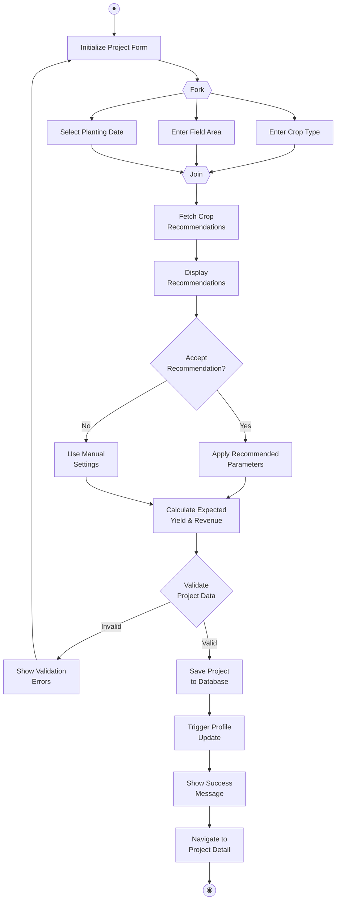

### 5.4 Sequence Diagram - Equipment Rental Process

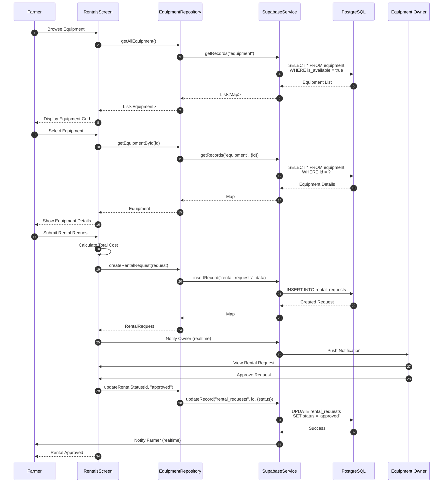

### 5.5 State Diagram - Farming Project States

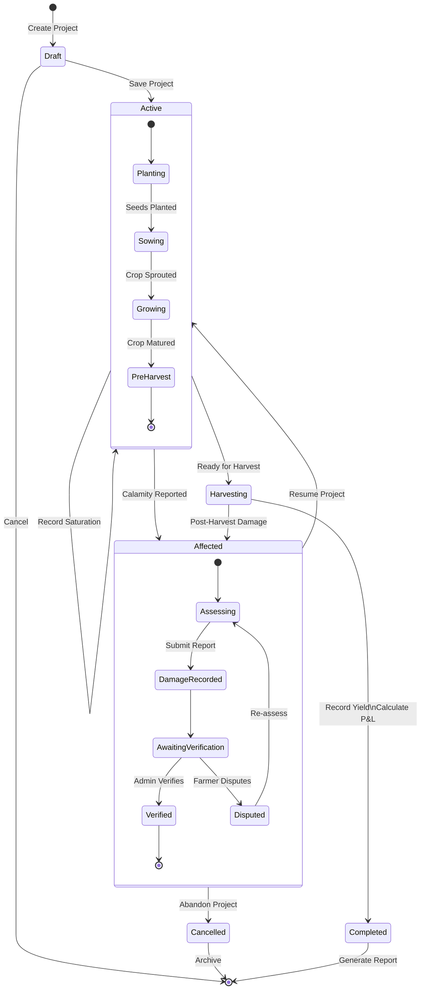

### 5.6 Deployment Diagram

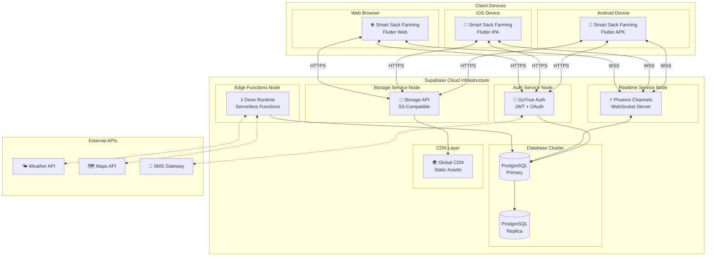

---

## 6. Process Design (DFD)

### 6.1 Context Diagram (Level 0)

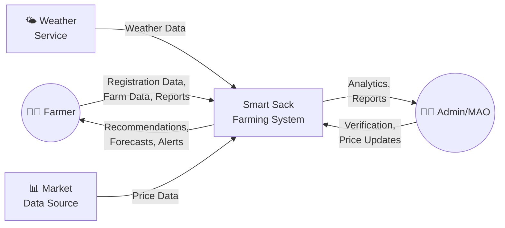

### 6.2 Level 1 DFD

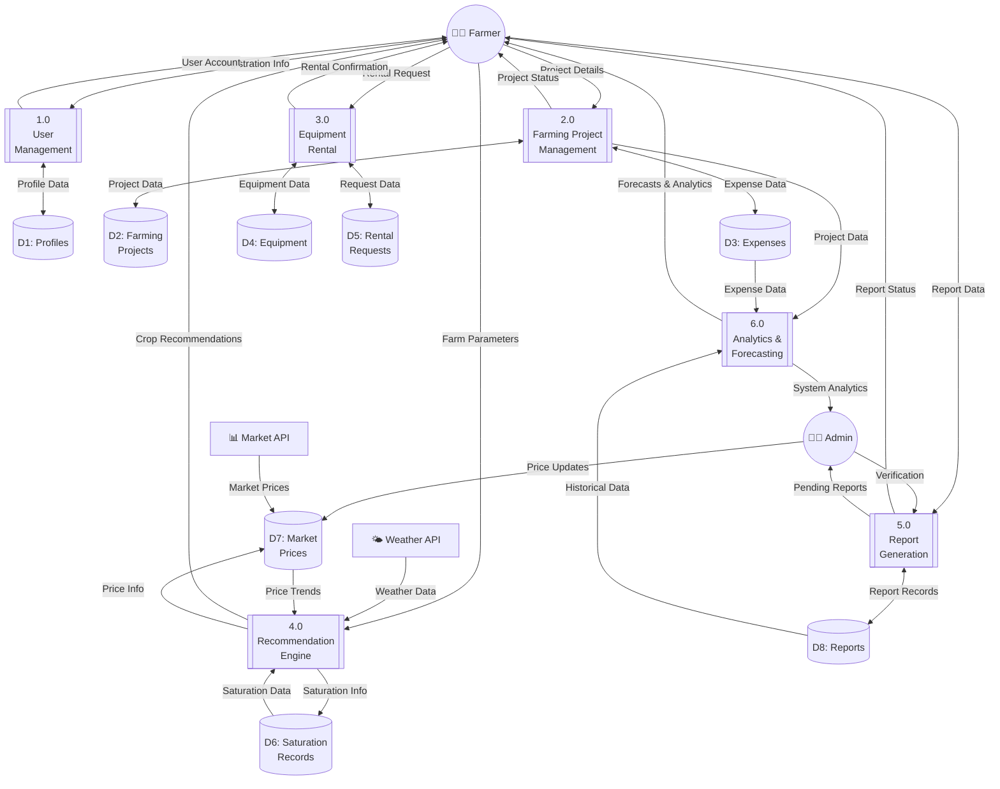

### 6.3 Level 2 DFD - Farming Project Management (Process 2.0)

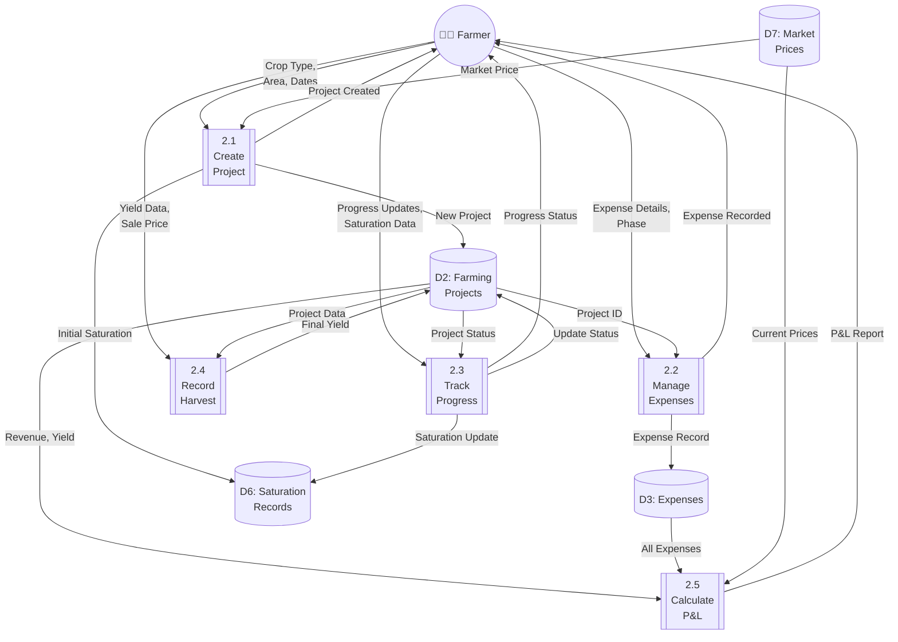

### 6.4 Level 2 DFD - Recommendation Engine (Process 4.0)

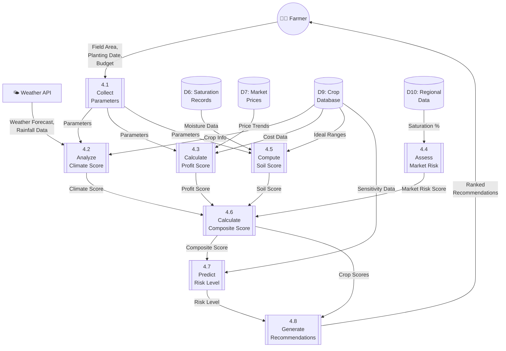

---

## How to Use in Draw.io

1. **Open Draw.io** (https://app.diagrams.net/)
2. **Create a new diagram** or open an existing one
3. Click **Arrange → Insert → Advanced → Mermaid**
4. **Paste the Mermaid code** from any section above
5. Click **Insert** to render the diagram
6. **Customize** colors, fonts, and layout as needed

### Alternative Method:
1. Go to **File → Import From → Text**
2. Select **Mermaid** format
3. Paste the code and click **Import**

---

## Document Information

| Item | Details |
|------|---------|
| **Project** | Smart Sack Farming |
| **Version** | 3.0 |
| **Date** | March 2026 |
| **Architecture** | Flutter + Supabase |
| **Database** | PostgreSQL (3NF) |
| **Pattern** | Repository + Service Layer |
